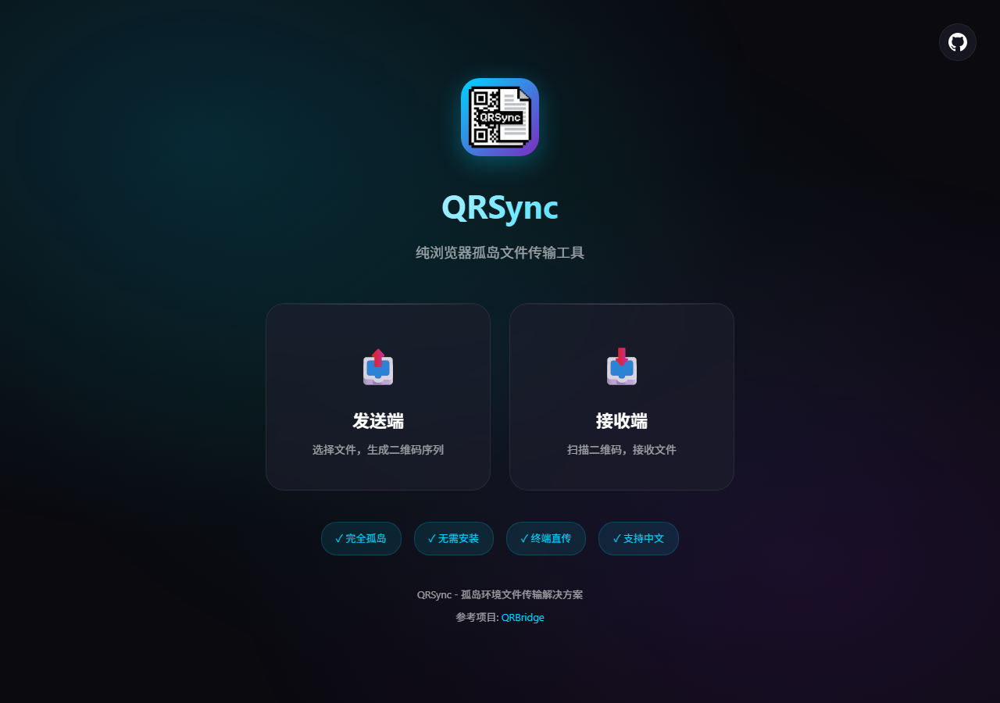
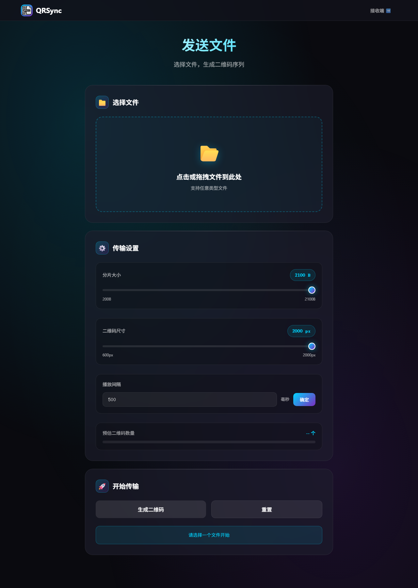
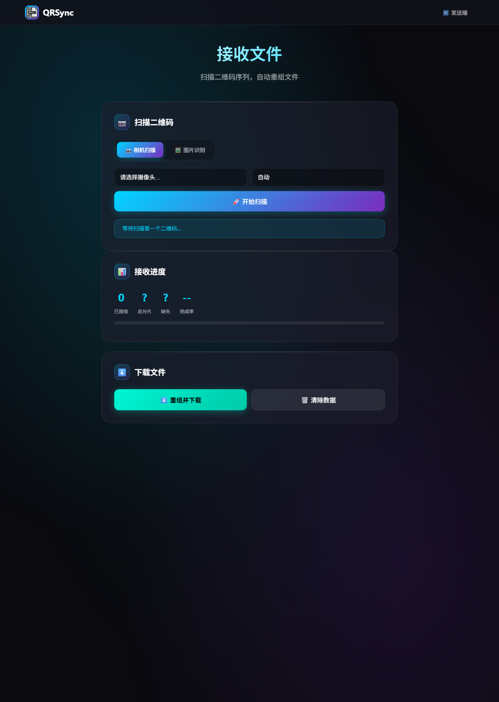

<p align="center">
  
</p>

<p align="center">
  <a href="README.md">简体中文</a> • <a href="README_EN.md">English</a>
</p>

<p align="center">
  
  
  
  
  
  
</p>

<p align="center">
  <b>QRSync</b> — A pure browser-based, fully offline file transfer tool for air-gapped environments.
</p>

<p align="center">
  Transfer any file via QR code sequences in environments with no network, no USB, no clipboard — only a screen and a camera.
</p>

<p align="center">
  <a href="#-online-demo">Online Demo</a> •
  <a href="#-why-qrsync">Why QRSync</a> •
  <a href="#-features">Features</a> •
  <a href="#-quick-start">Quick Start</a> •
  <a href="#-usage">Usage</a> •
  <a href="#-how-it-works">How It Works</a> •
  <a href="#-local-usage">Local Usage</a>
</p>

---

## 🌐 Online Demo

**👉 [Visit QRSync](https://huiihao.github.io/QRSync/)**

> Download the repository, load the page, then disconnect — it works fully offline.

<div align="center">
  
</div>

---

## 💡 Why QRSync

> **Air-gapped environments** are systems with no network access, USB ports disabled, clipboard restricted — only the screen and camera remain available.

| Scenario | QRSync Solution |
|----------|-----------------|
| 🔌 Air-gapped internal servers | Scan QR codes on screen with a phone to extract files |
| 🏢 High-security office environments | No USB, Bluetooth, or WiFi needed — visual transfer only |
| 📱 Quick phone-to-PC file transfers | No app install required — works right in the browser |
| 🚫 All conventional transfer methods blocked | QR codes are the last available data channel |

**Core advantages:**
- **Zero Dependencies** — No software install, no server, no network required
- **Fully Offline** — All data processing happens locally in the browser, nothing is uploaded
- **Cross-Platform** — Works on any device with a browser: Windows, macOS, Linux, Android, iOS

---

## ✨ Features

| Feature | Description |
|------|------|
| 🌐 **Pure Browser Implementation** | No installation, no server — just open and use |
| 📶 **Fully Offline Operation** | Works in completely isolated environments, data never leaves the device |
| 🔒 **Data Integrity Verification** | CRC32 checksum per chunk ensures accurate transmission |
| 📁 **Any File Type** | Text, images, documents, archives — all supported |
| 🇨🇳 **Chinese Filename Support** | UTF-8 encoding guarantees no garbled characters |
| 💾 **Resumable Transfer** | Progress auto-saved to IndexedDB, survives page refresh |
| 📷 **Camera + Image Modes** | Live camera scanning, or recognize saved / pasted QR images |
| ▶️ **Autoplay & Jump** | Sender can autoplay by interval and jump to a specific index |
| 📱 **Mobile Optimized** | UI and interactions tuned for phone camera scanning |
| 🎨 **Clean Modern UI** | Minimalist design with clear, intuitive workflow |

---

## 🚀 Quick Start

**Sender:** Open [Sender](https://huiihao.github.io/QRSync/sender/index.html) → Select file → Click "Generate QR Codes" → Enable autoplay or flip manually

**Receiver:** Open [Receiver](https://huiihao.github.io/QRSync/receiver/index.html) → Allow camera → Scan data chunks and the filename chunk → Click "Reassemble & Download"

---

## 📖 Usage

### 📤 Sending Files

1. Open the **[Sender Page](https://huiihao.github.io/QRSync/sender/index.html)**
2. Click or drag to select the file you want to transfer
3. (Optional) In **Transfer Settings**, adjust:
   - **Chunk size** (default 2100 B)
   - **QR size** (default 2000 px)
   - **Playback interval** (default 500 ms; click Confirm after changing)
4. Click **Generate QR Codes**  
   > If you change chunk size or QR size after generation, click **Generate QR Codes** again.
5. Present the **QR sequence** to the receiver:
   - Turn on **Autoplay**, or click **Play** to advance by interval
   - Or use Previous / Next, or **Jump to** a sequence index (including the final filename chunk)
6. (Optional) Use **Download All (ZIP)** / **Download Current** to export QR images for offline display or image-recognition mode

> The last frame is the **filename chunk** (orange border); earlier frames are data chunks (cyan border). The receiver **must** scan the filename chunk before **Reassemble & Download** is enabled.

<div align="center">
  
</div>

### 📥 Receiving Files

The receiver supports two modes: **Camera Scan** and **Image Recognition**.

#### Camera Scan

1. Open the **[Receiver Page](https://huiihao.github.io/QRSync/receiver/index.html)**
2. Keep **Camera Scan** selected; choose a camera (and optional resolution)
3. Click **Start Scanning** and allow camera permission
4. Scan the sender screen: data chunks may arrive out of order; you **must** scan the **filename chunk** (orange border) before download is enabled (recommended last)
5. When progress shows no missing chunks, click **Reassemble & Download**

> Chunks are stored by index in IndexedDB and restored after refresh. If some are missing, use **Jump to** on the sender and rescan.

<div align="center">
  
</div>

#### Image Recognition

1. Switch to **Image Recognition**
2. Click / drag / paste (`Ctrl+V` / `⌘+V`) QR images into the queue
3. Click **Scan** or **Scan All**
4. After all data chunks and the filename chunk are recognized, click **Reassemble & Download**

---

## 🔧 How It Works

### Data Flow

```
 Original File  ──[deflate compress]──▶  Compressed  ──[chunking]──▶  Data Chunks  ──[QR encode]──▶  Scan & Transfer
                                                                                                         │
 Complete File  ◀──[reassemble]──  Received Data  ◀──[QR decode]──  Scan & Receive  ◀─────────────────────┘
```

### QR Code Data Structure

**Data Chunks:**
```json
{
  "i": 0,          // Chunk index (0-based)
  "t": 5,          // Total data chunks
  "h": "a3f9b",    // CRC32 of the d field
  "f": "ABC12",    // File fingerprint
  "d": "base64…"   // Base64 of compressed chunk bytes
}
```

**Filename Chunk:**
```json
{
  "t": "fn",       // Type identifier (fn = filename)
  "f": "XYZ89",    // File fingerprint
  "n": "base64…",  // Base64-encoded UTF-8 filename
  "s": 1024,       // Original file size (bytes)
  "ts": 1234567890,// Unix timestamp (ms)
  "tc": 10,        // Total data chunk count
  "h": "abc12"     // CRC32 over the fields above (excluding h)
}
```

### Core Technology Stack

| Purpose | Library | Notes |
|---------|---------|-------|
| Compression | [pako](https://github.com/nodeca/pako) | zlib/deflate in the browser |
| QR Generation | [qrcode.js](https://github.com/davidshimjs/qrcodejs) | Pure JS QR code rendering |
| QR Scanning | [zxing-wasm](https://github.com/Sec-ant/zxing-wasm) + [jsQR](https://github.com/cozmo/jsQR) | Fast WASM decode with jsQR fallback; wasm embedded as base64 for `file://` |
| ZIP Export | [JSZip](https://github.com/Stuk/jszip) | Packs all QR images for "Download All" |
| Local Storage | [localForage](https://github.com/localForage/localForage) | Async IndexedDB wrapper (receive progress) |
| Data Integrity | CRC32 | Per-chunk checksum verification |

---

## 💻 Local Usage

### Method 1: Open Directly

1. Download and extract the repository
2. Double-click `index.html` to open the homepage
3. Navigate to sender and receiver pages as needed

### Method 2: Local Server

```bash
git clone https://github.com/huiihao/QRSync.git
cd QRSync

# Python
python -m http.server 8080

# or Node.js
npx serve .

# Open http://localhost:8080 in your browser
```

---

## 📦 Project Structure

```
QRSync/
├── index.html                 # Entry page
├── icon/
│   └── QRSync_icon.png        # App icon
├── sender/
│   ├── index.html             # Sender page
│   ├── sender.css             # Sender styles
│   └── sender.js              # Sender logic (chunking, generation, autoplay)
├── receiver/
│   ├── index.html             # Receiver page
│   ├── receiver.css           # Receiver styles
│   └── receiver.js            # Receiver logic (scan, verify, reassemble)
├── shared/
│   ├── theme.css              # Shared theme for sender & receiver
│   └── utils.js               # Shared helpers (CRC32, base64, filename codec, download/Toast)
├── js/
│   ├── qrcode.min.js          # QR code generation library
│   ├── pako.min.js            # Compression library
│   ├── jszip.min.js           # ZIP packaging library
│   ├── zxing-wasm-reader.js   # zxing-wasm decoder
│   ├── zxing_reader_wasm_b64.js # wasm binary (base64 embedded)
│   ├── jsQR.js                # QR recognition fallback
│   └── localforage.min.js     # Local storage library
├── LICENSE                    # MIT license
├── README.md                  # Chinese documentation
├── README_EN.md               # English documentation
└── docs/
    ├── PACKAGING.md           # Packaging guide
    └── screenshots/           # README screenshots
```

> Pure frontend project — no backend dependencies; pages, styles, and logic are modularized, with third-party libraries bundled locally.

---

## 🛠️ Packaging as Standalone Executable

See [docs/PACKAGING.md](docs/PACKAGING.md) for instructions on packaging this project as a standalone executable (Windows / Linux / macOS).

---

## ⚙️ Configuration

### Chunk Size

| Parameter | Value |
|-----------|-------|
| Range | 200 – 2100 bytes |
| Default | 2100 bytes |
| Tip | Smaller chunks improve scan reliability but increase QR count; larger chunks reduce QR count and need a bigger display size |

### QR Code Dimensions

| Parameter | Value |
|-----------|-------|
| Range | 600 – 2000 pixels |
| Default | 2000 pixels |
| Tip | Adjust to fit the full QR code on screen |

### Playback Interval

| Parameter | Value |
|-----------|-------|
| Range | 100 – 60000 ms |
| Default | 500 ms |
| Tip | Too short may miss frames; too long slows the whole transfer — tune for your camera and screen |

---

## 📝 Notes

1. **Filename chunk required** — **Reassemble & Download** stays disabled until the filename chunk is scanned; scan it last (orange border)
2. **Data chunks may be out of order** — stored by index; use sender **Jump to** to rescan missing ones
3. **Chunk Size** — Default is the maximum 2100 bytes to minimize QR count; reduce it if scanning fails, and keep the QR fully visible on screen
4. **Playback interval** — Default is 500ms; increase it if frames are missed, then play again
5. **File Size** — Recommended maximum 10MB (soft guideline); larger files produce many QR codes and take longer
6. **Screen Brightness** — Keep the sender screen at full brightness for best scan reliability
7. **Camera Focus** — Maintain an appropriate distance between camera and screen
8. **Checksum Failure** — If verification fails, simply rescan that QR code
9. **Download** — When complete, click **Reassemble & Download** only — there is no separate download button

---

## 🔒 Privacy

- All data is processed **locally in the browser** — nothing is ever uploaded
- Transfer progress is stored in the browser's IndexedDB, no privacy leakage
- CRC32 checksum and file fingerprinting prevent data corruption and cross-file mixing

---

## 🤝 Contributing

Issues and Pull Requests are welcome!

1. Fork the repository
2. Create your feature branch (`git checkout -b feature/AmazingFeature`)
3. Commit your changes (`git commit -m 'Add some AmazingFeature'`)
4. Push to the branch (`git push origin feature/AmazingFeature`)
5. Open a Pull Request

---

## 📄 License

This project is open source under the [MIT](LICENSE) license.

---

## 🙏 Acknowledgments

- Reference project [QRBridge](https://github.com/wallechfox/QRBridge) by [@wallechfox](https://github.com/wallechfox)
- [pako](https://github.com/nodeca/pako) — Fast zlib compression
- [qrcode.js](https://github.com/davidshimjs/qrcodejs) — QR code generation
- [zxing-wasm](https://github.com/Sec-ant/zxing-wasm) — WASM-based QR scanning
- [jsQR](https://github.com/cozmo/jsQR) — QR recognition fallback
- [JSZip](https://github.com/Stuk/jszip) — ZIP packaging
- [localForage](https://github.com/localForage/localForage) — Local storage

---

<p align="center">
  Made with ❤️ by QRSync Team
</p>
